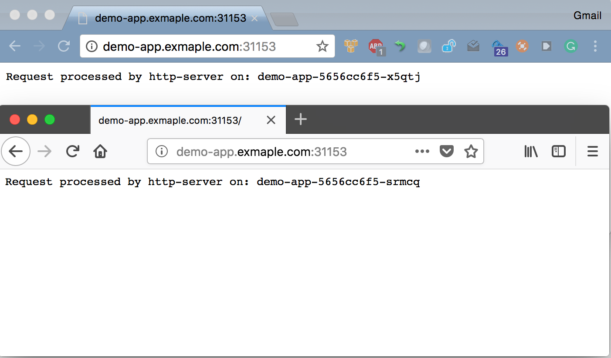

Scenario #1
===========

### Ingress intro:
Demo app
- deployment - `demo-app/deployment.yml`
- service - `demo-app/service.yml`
- ingress controller - `demo-app/ingress.yml`

### Step by step

[](https://asciinema.org/a/KzIn48XsgaPB45jXZvG863clf)

Service load balancing (deployment level) can be seen in the screenshot below using the dns name we mapped in `/etc/hosts` pointing at `$(minikube ip)`
The result should be like the following, please note the port we are using is the node port and considering we are using `minikube` it's quite easy to understand where the service is by running:

`kubectl get svc` which yields:

```json
kubectl get svc
NAME         TYPE        CLUSTER-IP     EXTERNAL-IP   PORT(S)          AGE
demo-app     NodePort    10.98.55.147   <none>        8080:31153/TCP   20h
```

